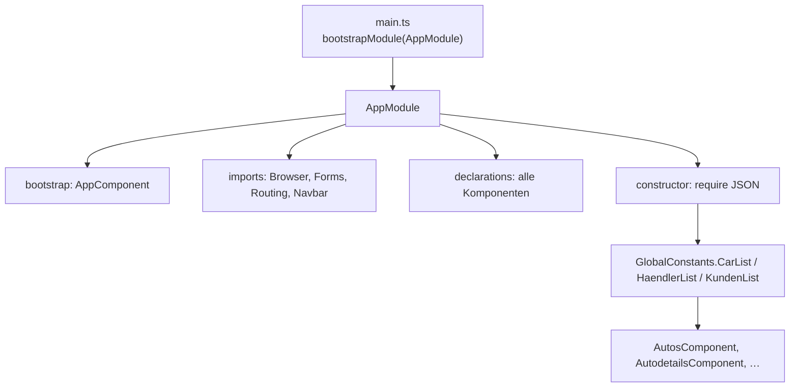
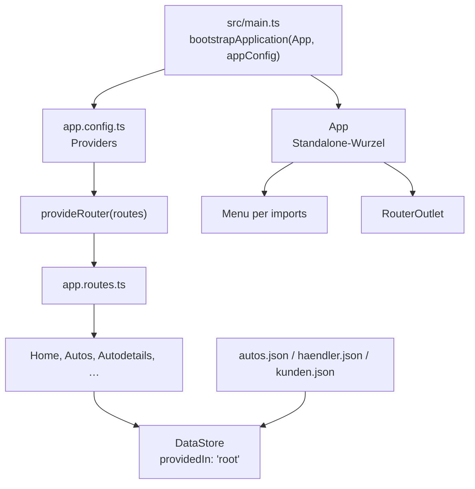
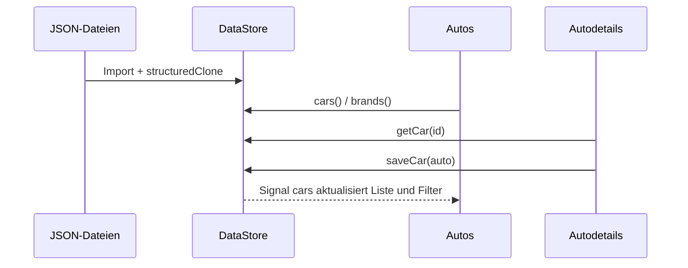

# Technischer Vergleich `alt/` ↔ `neu/`

Dieses Dokument beschreibt, wie die Angular-12-App in `alt/` in der Angular-22-App in `neu/` nachgebaut ist: was gleich bleibt, was wohin gewandert ist und wo das Verhalten bewusst abweicht.

In der alten App war `alt/src/app/app.module.ts` die zentrale Schaltstelle (Bootstrap, Imports, `declarations`, JSON-Singleton). In `neu/` gibt es dieses Modul nicht mehr. Dieselbe Verantwortung liegt auf mehreren Dateien.

## 1. Was gleich bleibt

Fachlich ist es dieselbe Anwendung:

- Lokale JSON-Dateien (`autos.json`, `haendler.json`, `kunden.json`) als Seed-Daten
- Ein zentraler In-Memory-Speicher (Singleton); Änderungen gelten nur dort, nicht in den Dateien
- Routen: `''` → `home`, `home`, `autos`, `autos/:ID?viewstate=…`, `haendler`, `person`
- Seiten: Home, Fahrzeugliste mit Markenfilter, Details / Editieren / Neu, Platzhalter Kunden und Händler
- Menü zeigt nur Home und Autos (Kunden/Händler bleiben auskommentiert bzw. ungenutzt)
- Bootstrap-Tabellen, Formulare, Alerts
- Modell-HTML in der Tabelle über `[innerHTML]` (z. B. `<b>Quantino</b>`)
- Neue ID = bisherige Listenlänge + 1
- Speichern nur, wenn `Marke` gesetzt ist

## 2. Plattform und Toolchain

| Thema | `alt/` (Angular 12) | `neu/` (Angular 22) |
| --- | --- | --- |
| Framework | `@angular/*` ^12.2.5 | `@angular/*` ^22.1 |
| TypeScript | ~4.0 | ~6.0 |
| Bootstrap | 5.1 + jQuery + Bootstrap-JS | 5.3, nur CSS |
| Navbar | `ngx-bootstrap-navbar` + `@angular/cdk` + Animationen | natives Bootstrap-Collapse per Signal |
| Change Detection | `zone.js` | zoneless (kein `zone.js`) |
| Einstieg | `NgModule` + `platformBrowserDynamic().bootstrapModule` | Standalone + `bootstrapApplication` |
| Builder | `@angular-devkit/build-angular:browser` | `@angular/build:application` (esbuild/Vite) |
| Tests | Karma + Jasmine (in der alten App kaum genutzt) | Vitest + jsdom |
| Polyfills | `src/polyfills.ts` (ZoneJS) | entfällt |
| Assets | `src/favicon.ico`, `src/assets` | `public/` |
| Selector-Wurzel | `my-app` | `app-root` |
| HTML-Sprache / Titel | minimales Fragment | `lang="de"`, Titel `Kundenservice` |

jQuery, Popper, `@angular/animations`, `@angular/cdk` und `ngx-bootstrap-navbar` entfallen. Formulare brauchen weiter `@angular/forms`, aber nur in `Autodetails`.

Build-Styles:

- Alt: Bootstrap-CSS **und** jQuery/Bootstrap-JS in `angular.json` → `scripts`
- Neu: nur `bootstrap.min.css` in `styles`; Collapse steuert Angular

JSON-Imports:

- Alt: `declare var require` + `require('./data/autos.json')` (CommonJS, zur Modul-Ladezeit)
- Neu: `import autosJson from './data/autos.json'` mit `resolveJsonModule` / `esModuleInterop` in `tsconfig.json`

## 3. Datei- und Namenszuordnung

Angular 22 erzeugt Komponenten ohne das Suffix `.component` (Datei `autos.ts`, Klasse `Autos`). Die Ordnerstruktur der Seiten ist gleich.

| Alt | Neu | Rolle |
| --- | --- | --- |
| `src/main.ts` | `src/main.ts` | Bootstrap |
| `src/polyfills.ts` | — | ZoneJS |
| `src/index.html` | `src/index.html` | Host-HTML |
| `src/styles.css` | `src/styles.css` | globale Styles (`#home`, Abstände) |
| `app/app.module.ts` | `app/app.config.ts` + `app.ts` + `data-store.ts` | Modul zerlegt |
| `app/routing.module.ts` | `app/app.routes.ts` | Routen |
| `app/app.component.*` | `app/app.ts` / `app.html` / `app.css` | Schale: Menü + Outlet |
| `app/global-constants.ts` | `app/models.ts` + `app/data-store.ts` | Typen vs. Speicher |
| `app/data/*.json` | `app/data/*.json` | Seed-Daten |
| `app/menu/menu.component.*` | `app/menu/menu.*` | Navigation |
| `app/sites/home/…` | `app/sites/home/…` | Startseite |
| `app/sites/autos/…` | `app/sites/autos/…` | Liste |
| `app/sites/autos/autodetails/…` | `app/sites/autos/autodetails/…` | Details/Edit/Neu |
| `app/sites/haendler/…` | `app/sites/haendler/…` | Platzhalter |
| `app/sites/person/…` | `app/sites/person/…` | Platzhalter |
| — | `app/data-store.spec.ts`, `app/sites.spec.ts` | Tests |

Komponenten-Decorator: alt `styleUrls: ['./x.component.css']`, neu `styleUrl: './x.css'`. Jede Standalone-Komponente hat ein `imports`-Array statt zentraler `declarations`.

## 4. Anwendungsstart und Modulsystem

### Was das alte `AppModule` getan hat

```23:48:alt/src/app/app.module.ts
@NgModule({
  imports: [
    BrowserAnimationsModule,
    BrowserModule,
    FormsModule,
    NgxNavbarModule,
    RoutingModule,
  ],
  declarations: [
    AppComponent,
    MenuComponent,
    HaendlerComponent,
    PersonComponent,
    HomeComponent,
    AutosComponent,
    AutodetailsComponent,
  ],
  bootstrap: [AppComponent],
})
export class AppModule {
  constructor() {
    GlobalConstants.CarList = myCars;
    GlobalConstants.HaendlerList = myHaendler;
    GlobalConstants.KundenList = myKunden;
  }
}
```

Vier Aufgaben in einer Klasse:

1. **Start** über `bootstrap: [AppComponent]`, ausgelöst von `platformBrowserDynamic().bootstrapModule(AppModule)`.
2. **Features** über `imports` (Browser, Formulare, Animationen, Navbar, Routing).
3. **Komponenten sichtbar machen** über `declarations`.
4. **JSON laden** im Konstruktor nach `GlobalConstants`.



### Aufteilung in `neu/`



**Bootstrap** – kein `NgModule` mehr:

```1:5:neu/src/main.ts
import { bootstrapApplication } from '@angular/platform-browser';
import { appConfig } from './app/app.config';
import { App } from './app/app';

bootstrapApplication(App, appConfig).catch((err) => console.error(err));
```

`BrowserModule` steckt in `bootstrapApplication`. Hot-Reload-Zerstörung über `window['ngRef']` (StackBlitz-Muster in `alt/src/main.ts`) entfällt.

**Globale Features** sind Provider:

```1:7:neu/src/app/app.config.ts
import { ApplicationConfig, provideBrowserGlobalErrorListeners } from '@angular/core';
import { provideRouter } from '@angular/router';
import { routes } from './app.routes';

export const appConfig: ApplicationConfig = {
  providers: [provideBrowserGlobalErrorListeners(), provideRouter(routes)],
};
```

| Alt (`AppModule.imports`) | Neu |
| --- | --- |
| `BrowserModule` | `bootstrapApplication` in `main.ts` |
| `RoutingModule` / `RouterModule.forRoot(routes)` | `provideRouter(routes)` |
| `BrowserAnimationsModule` | entfällt |
| `NgxNavbarModule` | Collapse in `Menu` |
| `FormsModule` global | nur in `Autodetails` |

**Komponenten:** früher zentrale `declarations`, jetzt lokale `imports`. Die Wurzel macht Menü und Outlet bekannt:

```1:13:neu/src/app/app.ts
import { Component, VERSION } from '@angular/core';
import { RouterOutlet } from '@angular/router';
import { Menu } from './menu/menu';

@Component({
  selector: 'app-root',
  imports: [RouterOutlet, Menu],
  templateUrl: './app.html',
  styleUrl: './app.css',
})
export class App {
  readonly name = 'Angular ' + VERSION.major;
}
```

`App.name` (`Angular 22`) bleibt wie in der alten Wurzel vorhanden, wird im Template aber weiterhin nicht angezeigt.

**Routing:** dieselben Pfade, andere Anbindung.

- Definition: `neu/src/app/app.routes.ts`
- Aktivierung: `provideRouter(routes)`
- Kein `RoutingModule` mit `exports: [RouterModule]`

Hinweis zur Reihenfolge: `autos/:ID` steht vor `autos`, sonst würde `0` oder `1` nicht als Parameter gelten. Das war in `alt/` schon so.

## 5. Datenhaltung: Singleton

Das Lehrziel bleibt: Daten einmal laden, nur im Speicher ändern, Speichern simulieren.

### Alt: statische Klasse, vom Modul befüllt

1. Beim Laden von `app.module.ts` drei `require()`-Aufrufe.
2. `AppModule`-Konstruktor schreibt nach `GlobalConstants.CarList` usw.
3. Komponenten importieren `GlobalConstants` und lesen/schreiben die Arrays direkt (`push`, `filter`, Zuweisung).

`GlobalConstants` ist ein klassischer statischer Singleton: nie instanziiert, Zustand in `public static`. Angular-DI war nicht beteiligt. Es gab keine Änderungsbenachrichtigung; Zone.js hat nach Events die Views aktualisiert.

### Neu: injizierbarer `DataStore`

```12:16:neu/src/app/data-store.ts
@Injectable({ providedIn: 'root' })
export class DataStore {
  readonly cars = signal<CARS[]>(structuredClone(autosJson) as CARS[]);
  readonly dealers = signal<HAENDLER[]>(structuredClone(haendlerJson) as HAENDLER[]);
  readonly customers = signal<KUNDE[]>(structuredClone(kundenJson) as KUNDE[]);
```

| Alt | Neu |
| --- | --- |
| `require('./data/autos.json')` | `import autosJson from './data/autos.json'` |
| Zuweisung im `AppModule`-Konstruktor | Signals beim Erzeugen des Services |
| `GlobalConstants` / `static` | `@Injectable({ providedIn: 'root' })` |
| `CarList.push` / Ersetzen des Arrays | `cars.update(…)`, `saveCar(…)`, `getCar(…)` |
| Marken per `for` + `indexOf` in `AutosComponent` | `brands = computed(…)` im Store |
| `haendlerZuweisen` / `kundeZuweisen` in der Komponente | `dealerName` / `customerName` im Store |
| Keine Kopie der JSON-Module | `structuredClone`, damit der Import unverändert bleibt |

`providedIn: 'root'`: eine Instanz für die App, überall per `inject(DataStore)`. Lazy: die Instanz entsteht beim ersten `inject`, nicht in einem Modul-Konstruktor.



Komponenten halten eine **Kopie** des Autos (`{ ...found }`) und schreiben erst beim Speichern zurück – wie `autoLaden()` in der alten App.

## 6. Dependency Injection und Change Detection

| Thema | Alt | Neu |
| --- | --- | --- |
| Router/Route | `constructor(private route: ActivatedRoute)` | `inject(ActivatedRoute)`, `inject(Router)` |
| Speicher | statischer Import `GlobalConstants` | `inject(DataStore)` |
| Zone.js | Pflicht | nicht im Projekt; zoneless |
| UI-Updates nach Store-Änderung | Zone fängt Events ab | Signals / DOM-Events (zoneless) |

Ohne Zone.js müssen Zustandsänderungen Angular erreichen. Deshalb Listenfilter und Menü-Collapse als Signals, der Speicher als Signal-Listen. `[(ngModel)]` bleibt möglich: Eingabe-Events markieren die View.

## 7. Templates: Control Flow

| Alt | Neu |
| --- | --- |
| `*ngIf="viewstate == 'details'"` | `@if (viewstate === 'details')` |
| `*ngFor="let auto of autoListe"` | `@for (auto of carList; track auto.ID)` |
| `*ngIf` / `*ngFor` über `CommonModule` (kam mit `BrowserModule`) | eingebaute Control-Flow-Syntax, kein `NgIf`/`NgFor`-Import |
| `==` in Templates | `===` |

`@for` verlangt `track`. Die Liste trackt `auto.ID`.

## 8. Listenansicht Autos

Fachlogik: volle Liste, Marken eindeutig sortiert, Filter setzt die sichtbare Liste; leere Auswahl zeigt wieder alle. Label der ersten Option: „Nach Marke filtern“ bzw. „Alle anzeigen“.

| Alt | Neu |
| --- | --- |
| Snapshot `autoListe` / `automarken` im Konstruktor | `computed` über `store.cars()` und `store.brands` |
| Filter ändert nur die lokale Kopie | `selectedBrand`-Signal filtert live |
| Neue Marke nach Speichern erst nach Reload der Komponente in der Combobox | `brands` folgt dem Store, Combobox aktualisiert sich |
| `routerLink="../autos/{{ auto.ID }}"` (relativ) | `[routerLink]="['/autos', auto.ID]"` (absolut) |
| `value="{{ marke }}"` | `[value]="brand"` |
| ungenutztes `RR()` | entfernt |

Relativ vs. absolut: unter `/autos` war `../autos/1` faktisch `/autos/1`. Absolut ist unabhängig vom aktuellen Pfad.

`[innerHTML]` für `Modell` ist unverändert (lokale Daten, Angular-Sanitizer lässt u. a. `<b>` durch).

## 9. Detail-, Edit- und Neu-Ansicht

`viewstate` kommt weiter aus dem Query-Parameter (`details` \| `edit` \| `new`). `ngOnInit` liest `ID` und `viewstate` aus dem **Snapshot** und ruft `selectAction` auf. Wechsel Edit/Details/Neu **auf derselben Komponente** braucht weiter `(click)="selectAction(…)"`, weil Angular die Instanz bei gleichem `autos/:ID` nicht neu erzeugt.

Ablauf `selectAction`:

- `details`: laden, Anzeige, `editmodus = false`
- `edit`: ggf. laden, Formular
- `new`: leeres Auto, ID = `length + 1`
- `save`: validieren (`Marke`), Namen zuweisen, in den Store schreiben, Meldung

### Speichern: bewusste Korrektur

Alt am Speichern-Button:

```html
<button routerLink="/autos/{{ auto.ID }}" [queryParams]="{ viewstate: 'details' }"
        (click)="selectAction('save')">
```

`routerLink` navigiert **immer**, auch wenn `Marke` fehlt. Die Fehlermeldung war dann oft weg, weil `ngOnInit` mit `viewstate=details` neu lief.

Neu: nur `(click)="saveAndStay()"`. Navigation nach Details erst, wenn kein `errorMessage` gesetzt ist.

Validierungstext: alt „Bitte Daten vervollstädigen!“, neu „Bitte Daten vervollständigen!“.

### Formular-Bindings

| Alt | Neu |
| --- | --- |
| `<option [value]="kunden[i].ID">` → oft **String** | `[ngValue]="kunde.ID"` → **Zahl** bzw. `null` |
| Leere Option `value=""` | `[ngValue]="null"` |
| `KundenID` / `HaendlerID` als `number`, faktisch teils string | `number \| null` |
| `RR(val)` gegen fehlendes `Vorname` | `displayName()` |
| `*ngFor` mit Index `kunden[i]` | `@for (kunde of kunden; track kunde.ID)` |
| Inputs ohne `name` | `name` an jedem `ngModel` (klarere Form-Controls) |

`==` in der alten Zuweisung (`h.ID == this.auto.HaendlerID`) hat String/Number vermischt. Mit `ngValue` bleiben IDs numerisch.

Neues Auto: alt `{} as CARS` (Felder undefined), neu explizite Leere (`Marke: ''`, IDs `null`).

## 10. Menü und Layout

| Alt | Neu |
| --- | --- |
| `ngxNavbarDynamicExpand` / `ngx-navbar-collapse` | `navbar-expand-lg` + `[class.show]="menuOpen()"` |
| `collapse.toggle()` der Direktive | `menuOpen`-Signal |
| `mr-auto` (Bootstrap 4-Rest) | `me-auto` (Bootstrap 5) |
| `nav-item active` fest auf Home | `routerLinkActive="active"` |
| Autos-Link immer aktivierbar auch auf `/autos/1` | `[routerLinkActiveOptions]="{ exact: true }"` nur auf `/autos` |
| keine Schließ-Logik nach Klick | `closeMenu()` nach Navigationsklick (Mobil) |

Kunden- und Händler-Links bleiben im Menü absichtlich weg; die Routen existieren weiter (`/person`, `/haendler`).

Globale Styles (`#home` zentriert, Body-Abstände) und die Autos-/Details-CSS sind übernommen. `nowrap` → Bootstrap-`text-nowrap`. HTML-Entities (`Fahrzeug-&Uuml;bersicht`) → Unicode (`Fahrzeug-Übersicht`).

## 11. Typen (`models.ts` vs. `global-constants.ts`)

Die JSON-Felder heißen weiter `ID`, `Marke`, `KundenID`, … Schnittstellen bleiben `CARS`, `HAENDLER`, `KUNDE`.

Anpassungen an echte JSON-Lücken:

- `KUNDE.Vorname` und `KUNDE.Telefon` optional (Datensatz „Otto“ ohne Vorname, „Meier“ ohne Telefon)
- `CARS.KundenID` / `HaendlerID`: `number | null` für „Bitte wählen“
- `CARS.Kunde` / `Haendler`: optional, nur Anzeige nach Zuweisung

In `alt/` waren diese Felder Pflichttypen, die JSON und `{} as CARS` aber nicht erfüllten.

## 12. Tests

`alt/` hatte Karma/Jasmine in der Konfiguration, aber keine fachlichen Specs im App-Code.

`neu/` (Vitest):

- `app.spec.ts` – Wurzel und Navbar-Brand
- `data-store.spec.ts` – Seed-Daten, Add/Update im Singleton
- `sites.spec.ts` – Home-Link, Autotabelle, Details mit Kundennamen, Validierung ohne Navigation, Persistenz über den Store

Zum Testen des Routers: `provideRouter` und `RouterTestingHarness` statt eines `RoutingModule`.

## 13. Kurzüberblick der Entsprechungen

| Aufgabe in `app.module.ts` / Alt-App | Datei bzw. Mechanismus in `neu/` |
| --- | --- |
| `bootstrapModule(AppModule)` | `src/main.ts` → `bootstrapApplication(App, appConfig)` |
| `bootstrap: [AppComponent]` | `src/app/app.ts` |
| `imports` (Browser, Router, …) | `src/app/app.config.ts` (`providers`) |
| `RoutingModule` | `src/app/app.routes.ts` + `provideRouter` |
| `declarations` | jeweilige Komponente: `imports` |
| `FormsModule` global | `FormsModule` nur in `Autodetails` |
| `NgxNavbarModule` | `src/app/menu/menu.ts` |
| `require` der JSON-Dateien | `import` in `data-store.ts` |
| Konstruktor → `GlobalConstants` | `DataStore` / `providedIn: 'root'` |
| Typen `CARS`, `HAENDLER`, `KUNDE` | `src/app/models.ts` |
| Zone.js | zoneless + Signals |
| `*ngIf` / `*ngFor` | `@if` / `@for` |
| jQuery + Bootstrap-JS | Angular-Collapse + Bootstrap-CSS |
| Relatives `routerLink="../autos/…"` | Absolutes `[routerLink]="['/autos', id]"` |
| Speichern immer per `routerLink` | `saveAndStay()` nur bei Erfolg |

## 14. Bewusste Abweichungen (Verhalten)

Unverändert bleiben Seed-Daten, Routen, Filterlogik, Viewstates und die Idee des einen Speichers.

Geändert, weil die alte Lösung technisch oder fachlich unsauber war:

1. Speichern ohne Marke bleibt im Formular und zeigt den Fehler (keine Navigation).
2. Select-Werte sind Zahlen/`null`, nicht Strings.
3. Markenliste und Autotabelle folgen dem Store (neues Fahrzeug mit neuer Marke erscheint ohne Komponenten-Neustart).
4. Aktiver Menüpunkt über `routerLinkActive`.
5. Tippfehler in der Validierungsmeldung korrigiert.
6. Kein jQuery; Navbar ohne Drittanbieter-Modul.

Nicht nachgebaut, weil es nur StackBlitz-/Altbestand war: `window['ngRef']`, `polyfills.ts` für IE, `enableProdMode` ohne Environment-Dateien, Protractor/TSLint.
